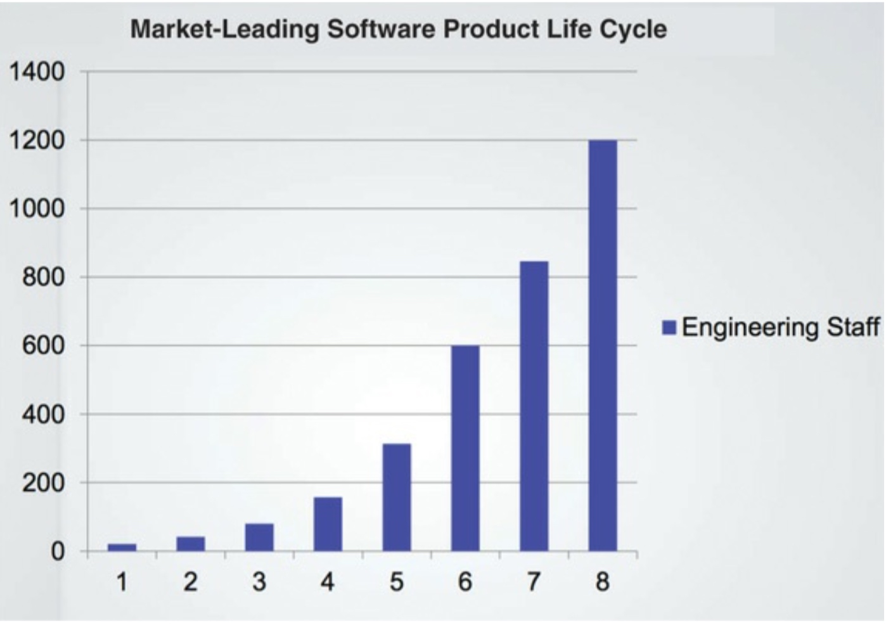
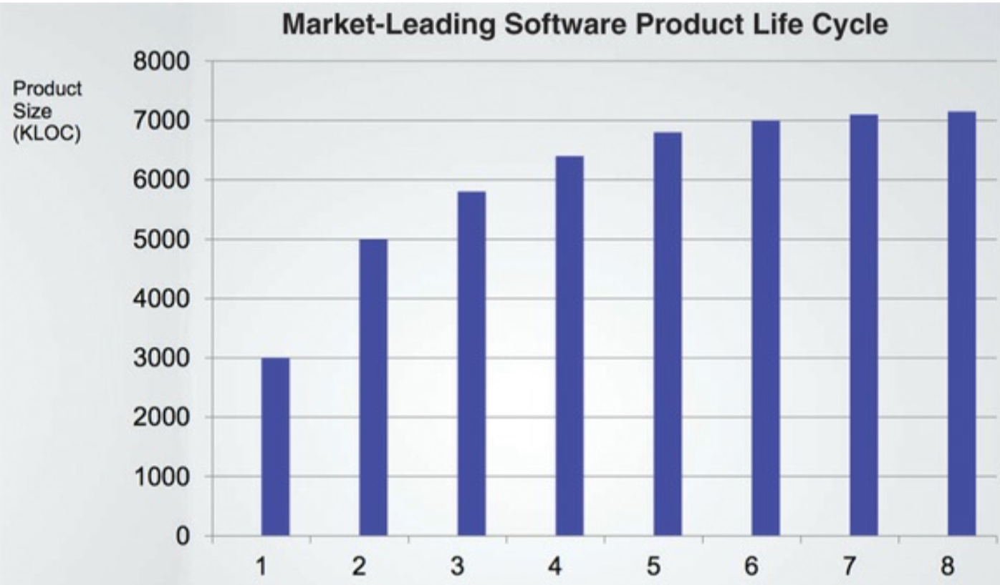
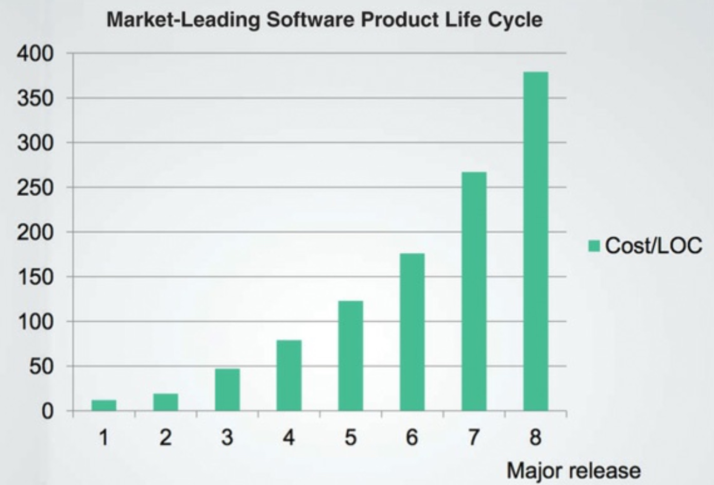
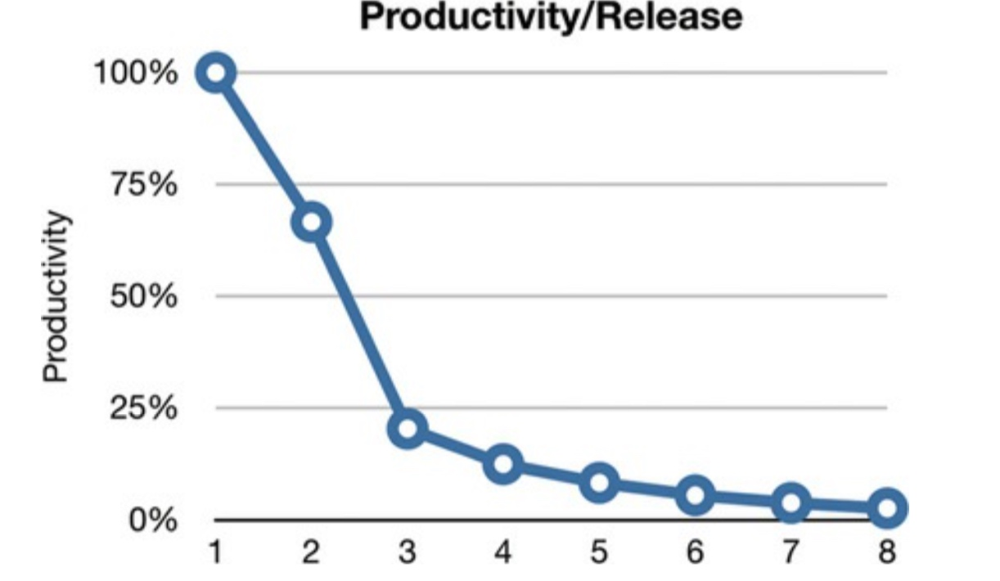
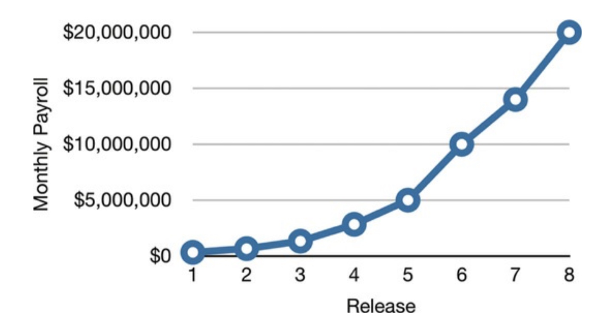

多年来关于设计和架构存在着许多困惑。什么是设计？什么是架构？它们之间的区别是什么？

本书的一个目的就是打破所有的困惑，并定于设计和架构是什么。首先，我将断言它们之间没有区别。一点也没有。

"架构"一词经常用于与低层次细节分离了的高层次上下文中，然而"设计"似乎经常表示在低层次上的结构和决定。但是当你观察一个真正的设计师做的事情的时候，这种使用方式是无意义的。

考虑设计师设计了我的新家。这个家有架构吗？当然有。那么那个架构是什么样的呢？它是家的形状，外观，立面以及空间房间的布局。但当我查看我的设计师提供的图纸，我看到了巨大数量的低层次细节。我看到了每一个插座、灯开关和灯将要被放置的位置。我看到哪些开关控制哪些灯。我看到暖气炉放在哪儿，热水器和抽水机的大小和位置。我看到了墙、屋顶和地基如何建造的细节描写。

简而言之，我看到了支持所有高层次决策的所有的小细节。我也看到了这些低层细节和高层决策是房子整体设计的一部分。

它与软件设计是一样的。低层细节和高层结构是同一个整体的所有部分。它们形成了一个连续的基础定义了系统的形状。你不能只取其一而忽略另外一个，事实上，它们之间没有清晰的分界线。从最高到最低层之间有一个决策的连续体。

### 目的？

这些决定的目的是什么？好的软件设计的目的是什么？目的就是我的理想化的描述：

>软件架构的目的在于最小化用于构建和维护所需系统的人力资源。

衡量设计质量可以简单地用满足客户需要而需要做的努力来度量。如果所需努力很低，在整个系统生命周期停留很短，设计就是好的。如果所需努力随着每个新的发布都在上升，设计就是坏的。就是这样简单。

### 样例学习

作为一个例子，考虑以下示例。它包含来自一个匿名公司的真实数据。

首先来看工程人员的增长。我确信你会同意趋势非常鼓舞人心。图1.1中展示的增长肯定预示着一个意义重大的成功。

图1.1

现在让我们看一下相同时间段这家公司的生产力，用代码行数来度量。

图1.2

明显有什么地方出错了。尽管每次发布都有更多开发人员支持，代码的增长似乎正在逼近一条渐近线。

下面是真正可怕的图：图1.3显示了每行代码的成本如何随时间变化。

图1.3

这个趋势不可维持。不管这个公司在此时有多赚钱：这条曲线将灾难性地消耗来自商业模式的利润，并让它停滞，如果没有完全让它倒闭的话。

什么引起了生产力如此重大改变？为什么版本8比1贵40倍？

#### 一团糟的签名

你正看到的就是一团糟的签名。当系统被匆忙地扔到一起，当绝对数量的程序员成为输出的唯一驱动因素，当很少或没有对设计的结构或代码的清晰性给予思考，然后你只能指望沿着这条曲线直到难看的结局。

图1.4显示了这条曲线对开发者而言是什么样子。他们从接近100%的生产力出发，但是随着每次发布他们的生产力都在减少。到第四次发布，很明显他们的生产力将要触底变成一条接近0的渐近线。

图1.4

从开发者的角度来看，这令人感到极大的沮丧，因为每个人正在艰难地工作。没有人减少他们的努力。

到目前为止，尽管他们做的所有这些英雄行为，加班时间和奉献精神，他们仍然不能简单地完成更多任何事情。他们所有的努力从实现新特性上被转移开，被管理这些混乱所消耗。他们的工作，如前所述，变成了移动这些混乱从一个地方到下一个，再下一个，下下一个地方，好让他们能够多增加一个粗劣的小特性。

#### 高管的视角

如果你认为这很坏，想象一下对于高管这幅图像是什么样子。考虑图1.5，它描绘了同时期的开发工资总支出。

图1.5

交付的第一个版本月度工资支出只有几百上千美元。第二个版本多花了几十万美元。第八个版本工资支出是两千万美元，单独这一张图表就很可怕了。明显一些触目惊心的事情正在发生。人们希望收入超过成本，从而证明费用合理。但是不管如何看这条曲线，它都会引起担忧。

现在来比较一下图1.5的曲线和图1.2每个版本代码行数。最初几十万美元每月购买了许多功能，但最后的两千万几乎什么也没买到。任何CFO看到这两张图都会明白必须立即采取行动来避免灾难。

但是可以采取什么行动？什么地方出错了？是什么导致了生产力的惊人下降？高管能做什么而不是跺脚或朝开发人员发怒？

#### 什么地方出错了

近2600年前，伊索告诉了乌龟和兔子的故事。这个故事的寓意已经多次以多种方式陈述：

>踏实和稳重是赢得比赛的关键
比赛不是迅速的，也不是强者的战斗
越急，速度越慢

这个故事本身就说明了过度自信的愚蠢。兔子对自身的速度如此自信，不认真对待比赛，当乌龟穿过终点线时还在打盹。

现代开发者也处于类似的比赛，并展示了相似的过度自信。当然，他们并不打盹 - 而是正相反。大多数现代开发人员都在努力工作。但是他们的大脑的一部分在睡觉 - 知道好的、整洁的、设计良好的代码是重要的那一部分。

这些开发者相信一个熟悉的谎言：我们可以过后清理它们；我们不得不先进入市场。当然，那些事情过后永远不会被清理，因为市场压力永远不会减弱。首先进入市场仅仅意味着你现在有一群竞争者跟在你后面，你必须跑得尽可能快来保持领先。

这样开发者永远不会切换模式。他们不能回头清理那些事情，因为他们不得不完成下一个特性，接着下一个，再下一个。因此，混乱产生，生产力渐近线继续朝零接近。

正如兔子对它速度过度自信，开发人员对他们保持生产力的能力也过度自信。但是，削弱他们生产力的代码的混乱永远不会停歇和减弱。如果按这个方法，它会把生产力在几个月内内减少到零。

开发人员相信的更大的谎言是这样一个概念，写混乱的代码会让他们短期内更快，只是长期会让他们变慢。接受这个谎言的开发者，展示了对于他们在未来从制造混乱的模式切换到清理混乱的模式的能力的过度自信，但是他们也弄错了一个简单的错误事实。事实是，制造混乱总是比保存整洁更慢，不管你使用什么时间维度。

