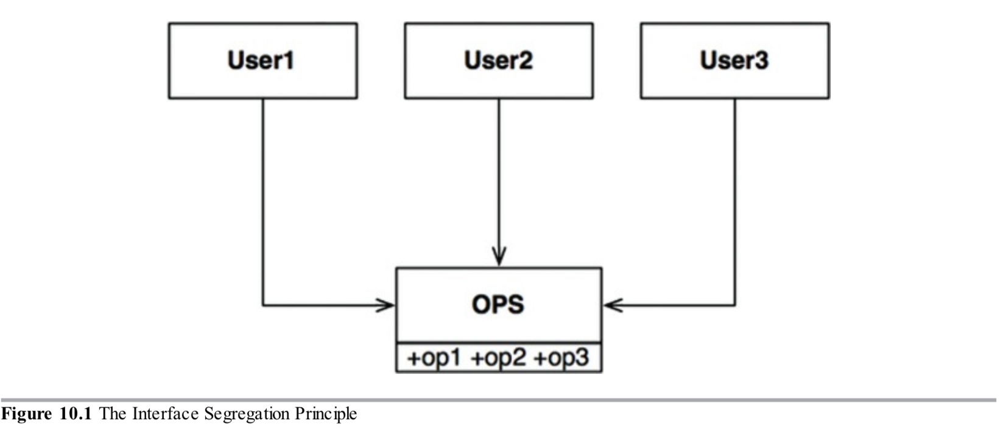
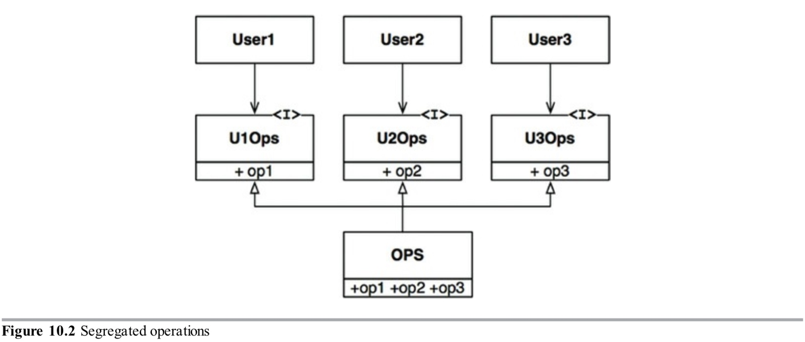

接口隔离原则(ISP)从图10.1中得出它的名字。

图10.1

图10.1说明的情况，有几个用户使用`OPS`类的操作。假设`User1`使用`op1`，`User2`使用`op2`，`User3`使用`op3`。

现在想象`OPS`类是用像Java这样的语言写的。显然在这种情况下，`User1`的源码一不注意就会依赖`op2`和`op3`，尽管没有调用它们。这个依赖意味着改变`OPS`类中`op2`的代码将强制`User1`重新编译和部署，尽管它关系的东西没有一点改变。

这个问题可以通过隔离操作为接口来解决，如图10.2所示。

图10.2

如果我们再次想象它用想Java这样的静态语言实现，`User1`的源码将依赖`U1Ops`和`op1`，但不会依赖`OPS`。因此对`OPS`进行`User1`不关心的修改，将不会导致`User1`重新编译和部署。

### ISP和语言
显然，上面的描述严重依赖语言的类型。像Java这样的静态语言强制程序员创建声明，用户必须`import`或`use`或者`include`。源码中这些`included`声明创建的源码依赖强制重新编译和部署。

在像Python和Ruby这样的动态语言，代码中不存在这样的声明。相反，它们在运行时推导。因此没有源码依赖强制重新编译和部署。这是动态语言相比静态语言创建的系统更有弹性和更少有紧耦合的主要原因。

这个事实会引导你总结出ISP是一个语言的问题，而不是架构的问题。

### ISP和架构

