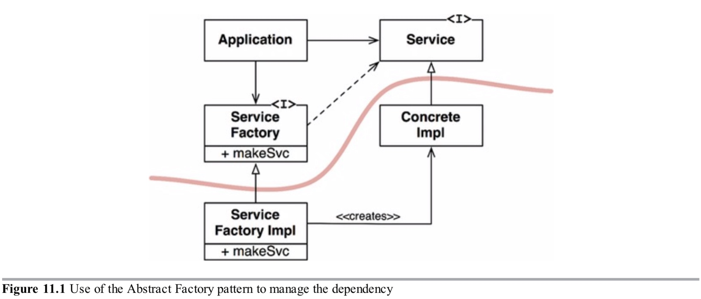

依赖倒置原则(DIP)告诉我们最灵活的系统是那些源码依赖只涉及抽象而不涉及具体的系统。

对一门静态语言来说，例如Java，这意味着`use`，`import`和`include`语句应该只引用包含接口，抽象类或其他一些抽象声明的源码模块。不应该依赖任何具体的模块。

同样的规则适用于动态类型语言，例如Python和Ruby。源码依赖不应该引用具体模块。但是在这些语言中定义什么是具体模块有一点困难。特别是，它是任何被调用的函数都实现了的模块。

显然，把这个想法当作规则是不现实的，因为软件系统必须依赖许多具体的工具。举例来说，Java中String类是具体的，尝试强制它变成抽象的是不现实的。源码依赖具体的`java.lang.string`不能也不应该避免。

相比之下，String类非常稳定。对这个类的修改非常少并被牢牢控制。程序员和架构师不必担心会对String进行频繁易变的修改。

基于这些原因，在DIP上我们倾向于忽略操作系统和平台工具的稳定背景。我们容忍这些具体依赖因为我们能依赖他们不会改变。

我们想要避免依赖的是我们系统的易变的具体元素。那些是我们正在活跃开发的模块，它们正在被频繁修改。

### 稳定抽象
对抽象接口的每次修改相当于修改它的具体实现。反过来说，对具体实现的修改并不总是要求修改它们实现的接口。因此接口比实现更不易变。

实际上，好的软件设计者和架构师努力减少接口的易变性。他们尝试找到给实现增加功能而不修改接口的方法。这就是软件设计101。

因此，这意味着稳定的软件架构是那些避免依赖于易变性结构，并且喜欢使用稳定的抽象接口的软件架构。这个含义归结为一组特定的代码实践：

- **不要引用易变的具体类。**用引用抽象类代替。这个规则适用于所有语言，不管是静态还是动态类型。它也会给构造对象施加几条限制并且通常来说强制使用抽象工厂。
- **不要继承易变的具体类。**它是前一条规则的必然结论，但是值得特别指出。在静态语言中，继承是所有源码关系中最强最严格的；因此它应该被小心使用。在动态类型语言中，继承问题没有那么大，但它仍然是一个依赖，因此小心总是一个明智的选择。
- **不要覆盖具体函数。**具体函数经常要去源码依赖。当你覆盖这些函数，你没有减少这些依赖，实际上，你继承了它们。为了管理这些依赖，你应该抽象这个函数并创建多个实现。
- **永远不要提及任何具体和易变的名字。**这仅仅是重申原则本身。

### 工厂
为了遵从这些规则，创建易变的具体对象需要特殊处理。这种谨慎是有道理的，因为实际上所有语言创建对象都要依赖那个对象具体定义的源码。

在大多数面向对象语言，例如Java，我们使用抽象工厂来管理这些不期望的依赖。

图11.1展示了这种结构。`Application`通过`Service`接口使用`ConcreteImple`。但是，`Application`必须通过某种方式创建`ConcreteImple`的实例。为了达到目的而不引入对`ConcreteImple`的源码依赖，`Application`调用`ServiceFactory`接口的`makeSvc`方法。这个方法由类`ServiceFactoryImpl`实现，该类继承自`ServiceFactory`。那个实现实例化`ConcreteImple`并返回它作为一个`Service`。

图11.1

图11.1中的曲线是架构边界。它分隔开抽象和具体。所有跨曲线的源码依赖指向相同方向，指向抽象那一边。

曲线把系统分为两个组件：一个抽象的和另一个具体的。抽象组件包含所有的应用的高层业务逻辑。具体组件包含所有那些业务逻辑操作的具体实现。

注意跨曲线的控制流与源码依赖的方向相反。源码依赖与控制流相反，这就是为什么我们说这条原则是依赖反转。

### 具体组件
图11.1中包含一个单一依赖，它违反了DIP。这是特有的。DIP违反不能完全移除，但是可以把它们聚集到一个少量的具体组件，与系统其它部分保存分离。

大多数系统至少包含一个这样的具体组件--经常叫`main`因为它包含`main`函数。在图11.1举例的情况中，`main`函数将会实例化`ServiceFactoryImpl`并把实例放到一个`ServiceFactory`类型的全局变量中。`Application`将通过全局变量来访问这个工厂。

### 总结
随着我们在书中向前推进并涵盖更多高层架构原则，DIP将会一再出现。它在我们的架构图中是最显而易见的组织原则。图11.1中的曲线将成为后面章节的架构边界。依赖在一个方向上跨过曲线，并指向更抽象的实体的方式，将成为我们称之为依赖规则的新规则。

