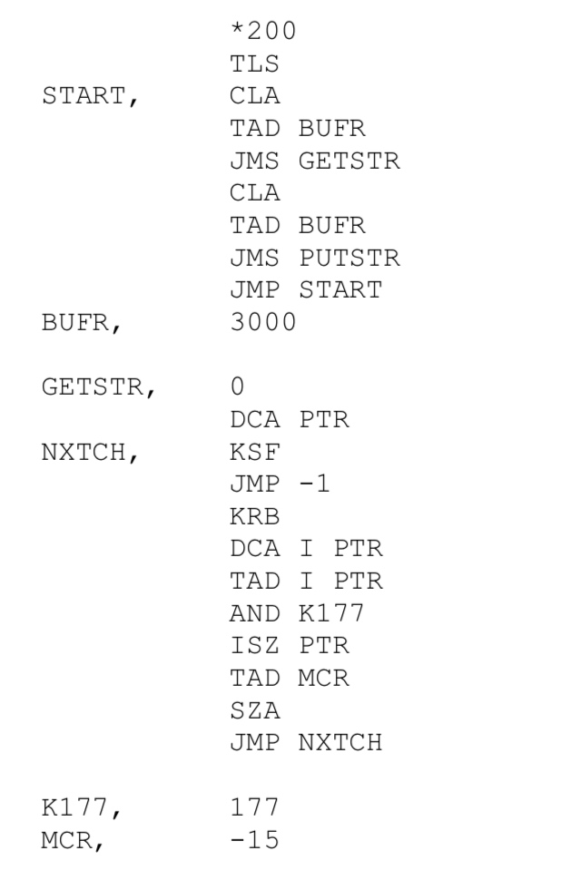
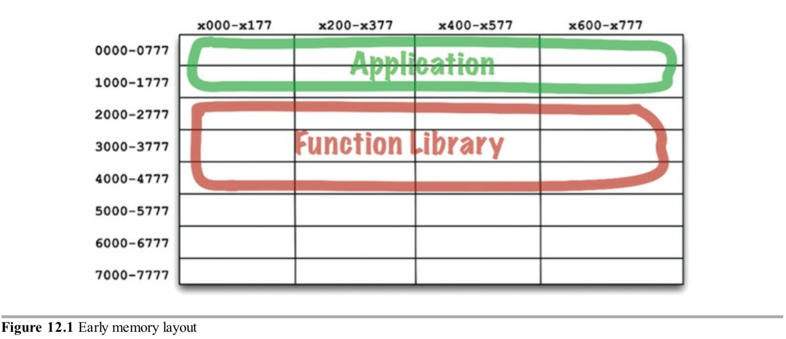
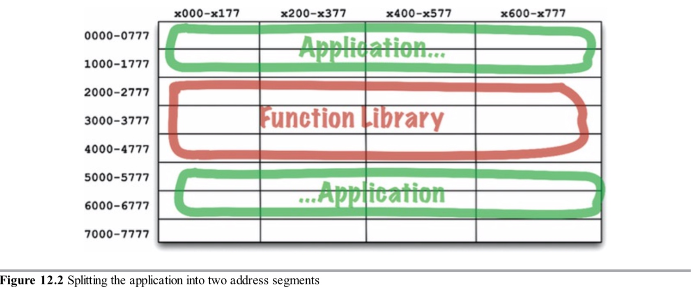

组件是部署的单元。它们是可以作为系统一部分部署的最小实体。在Java中，它们是jar文件。在Ruby中，它们是gem文件。在.Net中，它们是DLL。在编译型语言中，它们是二进制文件的集合。在解释型语言中，它们是源文件的集合。在所有语言中，它们是部署的颗粒。

组件可以被链接到一起成为单个可执行文件。或者它们可以被收集成单个档案文件，例如一个`.war`文件。或者它们可以被独立部署为分离的动态载入插件，例如`.jar`、`.dll`或`.exe`文件。不管它们最终如何部署，良好设计的组件通常会保留可独立部署和独立开发的能力。

### 组件的简史
在软件开发的早起，程序员控制他们程序的内存位置和布局。程序代码的第一行语句之一就是`origin`语句，它声明程序在哪个地址被载入。

考虑下面这个简单的PDP-8程序。它由一个叫做`GETSTR`的子程序组成，该子程序从键盘接收字符串输入并把它保存到缓冲区。它也有一些单元测试程序来运行`GETSTR`。

注意在程序开始处的`*200`命令。它告诉编译器生成的代码将在地址$200_8$被载入。

这类编程对今天的程序员来说是一个陌生的概念。他们极少需要考虑程序在计算内存的什么位置被载入。但是在早年，它是程序员首先要做的决定之一。在那个时候，程序不能被重定位。

在那个时候你如何访问一个库函数呢？预处理代码说明了使用的方法。程序员把库函数的源码包含进他们应用的代码，然后把它们编译成单个二进制程序。库以源码的形式保持，而不是二进制。

这个方法的问题是，在那个时期，设备很慢内存很昂贵，因此受到了限制。编译器需要对源码进行几次操作，但是内存太受限制不能让所有源码驻留在内存。结果是，编译器不得不使用很慢的设备读几次源码。

这会花费很长时间，你的库函数越大，编译器花费时间越长。编译一个大程序要花几个小时。

为了缩短编译时间，程序员把函数库的源码跟应用分离开来。他们单独编译函数库，然后在一个已知的地址载入二进制，比如地址$2000_8$。他们为函数库创建了符号表并与应用一起编译。当他们要运行一个应用，他们会载入二进制函数库然后载入应用。内存布局看起来像图12.1展示的那样。

图12.1

只要应用程序可以适应地址$0000_8$和$1777_8$之间，这种方法就可以正常工作。但是很快程序增加到比分配给它的空间更大。这时，程序员不得不划分他们的应用到两个地址段，跳过函数库（图12.2）。

图12.2

显然，这不是一个可维持的情况。随着程序员添加更多函数到函数库，它超过了它的边界，程序员不得不为库分配更多空间（在这个例子，接近$7000_8$）。程序和库的段必然随着计算机内存增长而增长。

明显，需要做一些事情了。

