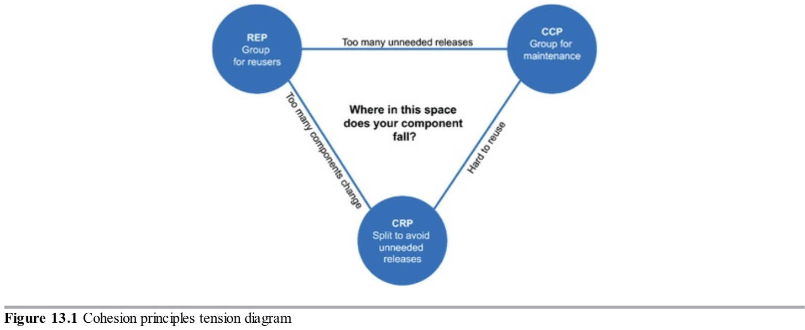

哪些类属于哪些组件？这是一个重要的决定，需要好的软件工程原则指导。不幸地是，多年来，这一决定几乎完全基于背景而以临时方式作出。

本章，我们将讨论组件内聚性的三个原则。

- REP: The Reuse/Release Equivalence Principle 重用/发布等价原则
- CCP: The Common Closure Principle 通用封闭原则
- CRP: The Common Reuse Principle 通用重用原则

### 重用/发布等价原则

`重用最小的粒度就是发布最小的粒度。`

最近十年模块管理工具例如Maven，Leiningen和RVM崛起了。这些工具的成长很重要，因为在此期间，大量的组件和组件库被创建。我们生活在软件重用的时代，实现了面向对象模型最古老的承诺之一。

重用/发布等价原则（REP）是一个至少事后来看显而易见的原则。想重用软件组件的人不能也不愿这样做，除非这些组件被一个发布流程追踪并且赋予一个发布号。

这事不简单因为没有发布发布号它们将没有办法保证所有重用的组件彼此兼容。更确切地说，它反映了软件开发者需要知道当新的发布到来，这些新发布将带来哪些修改这个事实。

开发人员被告知新版本发布并根据该版本中的更改决定继续使用旧版本的情况并不少见。因此发布流程必须产生合适的通知和发布文档来让用户做出是否和什么时候集成新版本的有依据的决定。

从软件设计和架构的观点来看，这条原则意味着类和模块形成组件必须属于一个内聚组。组件不能简单地由类和模块的随机大杂烩组成，相反，必须有一些所有模块都共享的主题或目的。

当然，这是显而易见的。但是，从另一个方面来看这个问题就可能不是如此显而易见了。类和模块被组合到组件中应该可以一起发布。它们共享同一个版本号和同一个发布追踪以及同一个发布文档的事实，对作者和用户应该都是有意义的。

这是一个弱的建议：说某事应该"有意义"只是一种在空中挥手尝试让话听起来有权威性的方法。这是一个弱建议因为很难解释这个把类和模块粘在一个组件的胶水。尽管建议很弱，但是原则本身是重要的，因为很容易检测是否违反它--它们"没有意义"。如果你违反REP，你的用户将会知道，他们就不会对你的架构技巧印象深刻。

这一原则的弱点可以通过下面两个原则的力量得到补偿。事实上，CCP和CRP强烈地定义了这一原则，但是是在负面意义上。

### 通用封闭原则
`将那些因同样原因同时发生变化的类收集到组件中。将那些在不同时间和不同原因发生变化的类分成不同的组件。`

这是为组件而重新声明的单一职责原则。正如单一职责原则SRP说类不应该包含多个修改的原因，通用封闭原则CCP说组件不应该有多个修改的原因。

对大部分应用来说，可维护性比可重用性更重要。如果应用中的代码必须修改，宁愿所有的修改发生在一个组件，而不是分布在多个组件中。如果修改限制在单个组件，那么我们只需要重新部署一个被修改的组件。其他组件如果不依赖被修改的组件则不需要被重新验证或重新部署。

CCP原则促使我们把所有可能会因为相同原因而修改的类收集到一处。如果两个类如此紧密绑定，不管是物理上还是概念上，以至于它们经常一起修改，那么它们属于相同组件。这样会最小化软件重新发布、验证和部署相关的工作量。

这个原则与开闭原则OCP密切相关。实际上，CCP所说的即是OCP意义上的"封闭"。OCP声明类应该对修改关闭而对扩展开放。因为100%封闭是不可行的，封闭必须是关键性的。我们设计我们的类让它对大多数我们能预期或已经经历过的通用的修改类型封闭。

CCP通过收集那些对相同修改类型封闭的类到相同的组件来扩大这个原则。因此，当一个需求的修改到来，修改有大的概率会被限制在最小数量的组件中。

#### 与SRP的相似性
正如之前所说，CCP是组件形式的SRP。SRP告诉我们划分方法到不同的类，如果它们会因为不同原因而修改。CCP告诉我们划分类到不同组件，如果它们会因为不同原因而修改。这两个原则可以用下面这段话总结：

>将那些因同样原因同时发生变化的事物聚集到一起。将那些在不同时间和不同原因发生变化的事物划分开来。

### 通用重用原则
`不要强迫组件的用户依赖他们不需要的东西。`

通用重用原则CRP是帮助我们决定哪些类和模块应该放到一个组件的另一个原则。它陈述的是那些倾向一起被重用的类和模块属于相同的组件。

类很少被单独地重用。更典型的是，可重用类与其它属于可重用抽象的一部分的类互相协作。CRP声明这些类属于相同的组件。在这样的组件里我们期望看到类之间有许多依赖。

一个简单的例子是容器类和它的迭代器。这些类被一起重用因为它们之间紧密耦合。因此它们应该在相同的组件里。

但是CRP不止告诉我们哪些类应该放到一个组件里：它也告诉我们哪些类不应该放到一个组件里。当一个组件使用另一个，一个组件间的依赖被创建了。也许使用方只使用了被使用组件里的一个类，但是那样仍然没有削弱这个依赖。使用方组件依赖被使用的组件。

因为这个依赖，被使用的组件每次修改，使用方组件可能要做相应的修改。尽管使用方组件没有必要修改，它仍可能要重新编译，重新验证和重新部署。尽管使用方组件不关心被使用组件的修改这仍然是成立的。

因此当我们依赖一个组件，我们想要确保我们依赖那个组件的每个类。换一种说法，我们想要确保我们放到一个组件中的那些类是不可分割的--即不可能依赖某些而不依赖另外一些。否则，我们将会重新部署比需要的更多的组件，浪费大量的努力。

#### 与ISP的关系
CRP是通用版本的ISP。ISP建议我们不要依赖具有我们不使用的方法的类。CRP建议我们不要依赖有我们不使用的类的组件。

所有这些建议归结为一句话：
>不要依赖你不需要的东西。

### 组件内聚性的张力图
你可能意识到了这三个原则会互相抵触。REP和CCP是包含性原则：它们倾向于让组件变得更大。CRP是排斥性原则，驱使组件更小。这些原则之间的张力是好的架构师要寻求解决的。

图13.1是一个张力图，它显示了内聚性的三个原则彼此之间如何交互。图的边描述了抛弃对面顶点上的原则的代价。

图13.1

一个只关注REP和CRP的架构师将会发现当做小的修改时会有太多组件受影响。相反，一个太强烈关注CCP和REP的架构师将会导致产生太多不必要的发布。

一个好的架构师能够在这个张力三角形之中发现一个位置，它满足当前开发团队的考虑，但是也意识到这些考虑会随时间而变化。举例来说，一个项目的开发早期，CCP比REP更重要，因为可开发比可重用更重要。

通常来说，项目倾向于从三角形的右边开始，它唯一牺牲的是重用。随着项目成熟，其他项目开始借鉴它，这个项目将会滑向左边。这意味着项目的组件结构会随时间和成熟度而变化。比起项目实际做的，它更与项目的开发和使用方式相关。

### 总结
过去，我们关于内聚性的看法比REP、CCP和CRP所指的简单得多。我们曾经认为内聚是简单的属性，即模块表现得如仅仅一个函数那样。但是，组件内聚的三个原则描述了一个内聚的更复杂的变体。在选择类组织到组件时，我们必须考虑到关于可重用性和可部署性的相反力量。根据应用的需要来平衡这些力量是很重要的。此外，平衡经常是动态的。也就是说，对今天来说合适的分区可能明年就不合适了。因此，随着项目的关注点从可开发性到可重用性变化，组件的组成可能会随着时间而发生抖动和演变。

