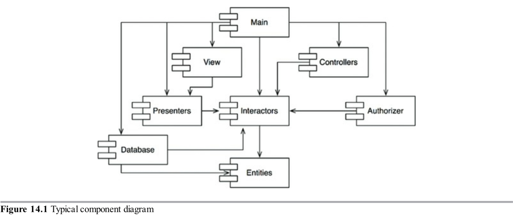
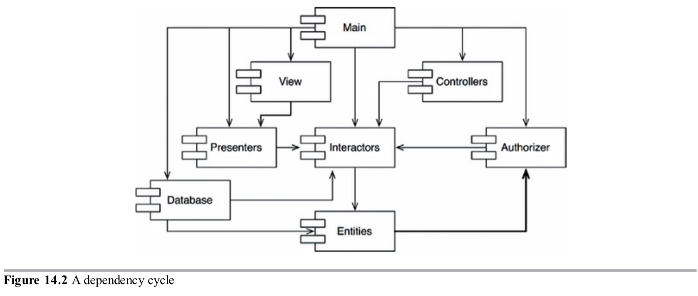
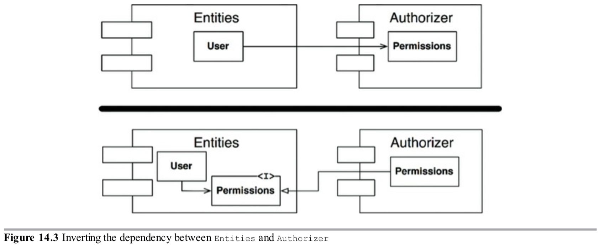
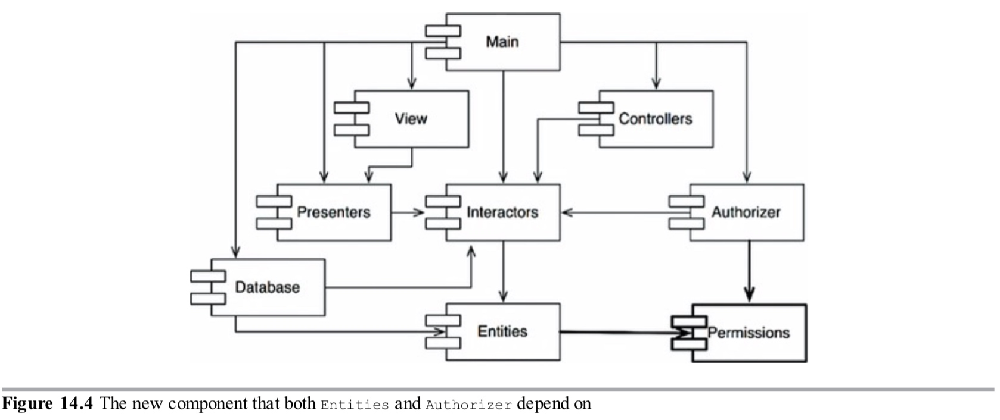
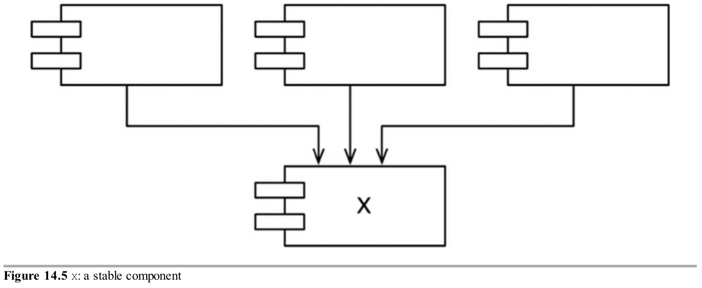
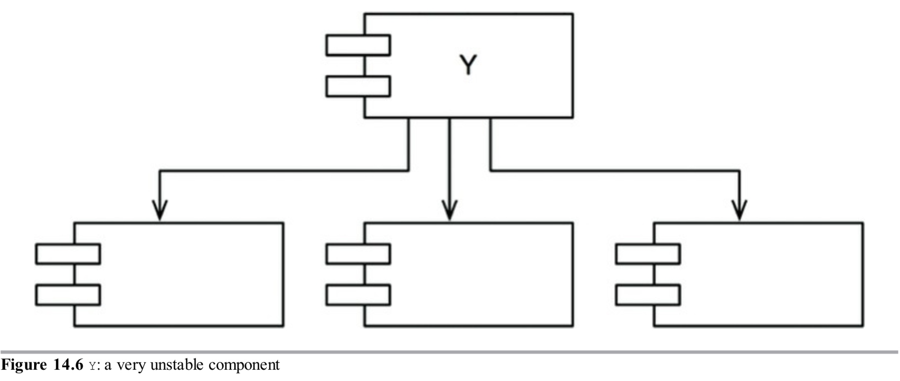

接下来的三个原则处理组件之间的关系。我们在这里会再次遇到可开发性和逻辑设计之间的张力。这股影响组件架构的力量是技术上的、政治上的和易变的。

### 无环依赖原则

`在组件依赖图中不允许环形依赖。`

你经历过工作了一整天让程序正常工作，然后回家，仅仅到第二天早晨就发现你的程序再也不能工作了吗？为什么它无法工作？因为有人比你加班更晚，并且修改了你依赖的一些东西。我称它为“综合征后的早晨”。

“综合征后的早晨”发生在许多开发者正在修改相同源文件的开发环境。在只有几个开发者的相对小的项目，这不是大问题。但是随着项目和开发团队的增大，这些早晨会变成噩梦。几个星期之后团队还没有构建一个项目的稳定版本是不常见的。实际上，每个人会持续修改他们的代码来让它们能够在其他人最后修改的代码之上工作。

过去最近几十年，对这个问题发展出了两个方案，它们都出自通信产业。第一个是”每周构建“，第二个是无环依赖原则（ADP）。

#### 每周构建
每周构建通常用在中等规模的项目。它这样工作：所有开发者在一周的前四天忽视其他人，他们都在代码的私有拷贝上工作，不用担心集成他们的工作到一个共同的基础上。然后在星期五，他们集成所有的修改并构建系统。

这种方法有一个很好的优点，它能让开发者一周五天中有四天处于一个隔离的环境中。当然，缺点就是周五会受到大的集成的惩罚。

不幸地是，随着项目增长，在周五完成集成变得越来越不可行。集成的负担开始增长直到溢出到周六。几个这样的周六足以说服开发者集成应该从周三开始--然后开始集成的时间慢慢地挪到了一周的中间。

随着开发与整合的工作周期减少，团队的效率也降低了。最终这个方案变得让人沮丧，开发者或项目经理宣布日程应该改为双周构建。这在一段时间内能满足要求，但是集成的时间会随着项目变大而持续增加。

最终，这种事态导致危机。为了维持效率，构建时间周期不得不持续延长--但是延长构建时间周期增加了项目风险。集成和测试越来越困难，团队失去了快速反馈带来的好处。

#### 消除依赖循环
这个问题的解决方案是把开发环境划分为可发布的组件。组件变成了工作单元，它可以由一个开发者或一个团队负责。当开发者的组件可以工作了，他们发布它给其他开发者使用。他们给它一个发布号并移动到一个给其他团队用的目录。然后他们继续在他们的私有区域修改他们的组件。每个人使用发布的版本。

当一个组件的新版本可用，其他团队可以决定他们是否马上采用新版本。如果他们决定不采样，他们只需简单地继续使用旧版本。一旦他们准备好了，他们就可以开始使用新版本。

因此没有团队受其他团队支配。对一个组件的修改不会立即影响到其他团队。每个团队可以决定他们什么时候为他们的组件适配新版本的组件。此外，集成以小的增量发生。没有一个单一的时间点，需要所有开发者到一起集成所有他们做的事情。

这是一个非常简单合理的流程，并且被广泛使用。但是，为了让它工作得更成功，你必须管理组件的依赖结构。不能有任何循环。如果在依赖结构中存在循环，那么“综合征后的早晨”就不可避免。

思考一下图14.1的组件图。它展示了一个十分典型的集成到应用中的组件结构。应用的功能对这个例子来说是不重要的。重要的是组件的依赖结构。注意这个结构是一个有向图。组件是节点，依赖关系是有向的边。

图14.1

在注意一件事：不管你从哪个组件开始，沿着依赖关系不可能又回到那个组件。这个结构是没有循环的。这是一个有向无环图（DAG）。

现在考虑下当负责`Presenters`的团队发布了一个新版本时会发生什么。很容易找到谁依赖这个组件；你只需沿着依赖箭头回溯。因此`View`和`Main`将会受影响。为这些组件工作的开发者将决定他们应该什么时候用新版本的`Presenters`和他们的工作集成。

同时注意如果`Main`发布之后，它完全不会影响系统中其他组件。它们不知道`Main`，当`Main`修改它们也不关心。这很棒。它意味着发布`Main`的影响相对来说小。

当为`Presenters`工作的开发者要运行它的测试，他们只需要用他们当前使用的`Interactors`和`Entities`组件构建他们的`Presenters`版本。系统中的其他组件没有一个需要被涉及。这点很不错。这意味着为`Presenters`工作的开发者为了设置测试只有相对少的工作要做，他们只有相对少的变量要考虑。

当到了发布整个系统的时候，这个过程自底向上进行。首先`Entities`组件编译，测试和发布。然后对`Database`和`Interactors`做相同的事。接着是`Presenters`,`View`,`Controllers`这几个组件，最后是`Authorizer.Main`。这个过程非常清晰并容易处理。我们知道如何构建系统因为我们理解它的组成部分之间的依赖。

#### 组件依赖图中循环的影响
假设一个新的需求强制我们修改`Entities`中的一个类，让它使用`Authorizer`中的一个类。例如，`Entities`中的`User`类使用`Authorizer`中的`Permissions`类。这会创建一个如图14.2所示的依赖循环。

图14.2

这个循环产生了一些直接的问题。例如，为`Database`组件工作的开发者知道，为了发布他的组件必须与`Entities`兼容。但是，因为那个循环，`Database`组件也必须与`Authorizer`组件兼容。但是`Authorizer`依赖`Interactors`。这会让`Database`更难以发布。`Entities、Authorizer`和`Interactors`实际上变成了一个大的组件，这意味着所有为这些组件工作的开发者都将经历令人恐惧的“综合征后的早晨”。他们将踩到彼此，因为他们全都必须使用完全相同版本的其他组件。

但是这只是一部分麻烦。思考一下当我们想要测试组件时会发生的事。让我们懊恼的是，我们发现必须与`Authorizer`和`Interactors`一起编译和集成。这种组件之间的耦合程度即便不是不可忍受的也是一件麻烦的事。

你可能会想知道仅仅为了运行你的一个类的一个简单的单元测试，为什么不得不包含这么多库和这么多别人的东西。如果你对此事进行一点调查，你可能将会发现依赖图中存在循环。这样的循环让隔离组件非常困难。单元测试和发布变得非常困难和容易出错。此外，构建问题会随着模块数量成几何级数增加。

更进一步，当依赖图中存在循环，理解你必须构建的组件的顺序变得非常困难。实际上，它不存在正确的顺序。这会导致在编程语言中如Java从编译后的二进制文件读取它们声明的非常难以处理的问题。

#### 打破循环
总是能够打破组件的循环并把依赖图恢复为DAG。有两个主要的机制来这样做：

1. 应用依赖倒置原则（DIP）。在图14.3中，我们创建了一个包含`User`类需要的方法的接口。我们可以把这个接口放到`Entities`并继承到`Authorizer`。这会反转`Entities`和`Authorizer`之间的依赖，因此打破了循环。

	图14.3
	

2. 创建一个`Entities`和`Authorizer`都依赖的新组件。把它们都依赖的类移到新组件中（图14.4）。

	图14.4
	

#### "紧张不安"
第二种方法暗示着组件结构在改变着的需求面前是易变的。实际上，随着应用增长，组件依赖结构也会抖动和增长。因此必须经常监控依赖结构的循环。当循环存在，它们必须被打破。有时这意味着创建新组件，让依赖结构增长。

### 自上而下设计
到目前为止我们讨论的问题导致了一个不可避免的结论：组件结构不能自上而下设计。它不是系统设计的第一件事，而是随着系统的发展和变化而演变。

一些读者可能会发现这一点是反直觉的。我们已经开始期望像组件一样的大粒度分解也将是高层次的功能分解。

当我们看到一个大粒度分组例如一个组件依赖结构，我们相信这些组件在某种程度上代表系统的功能。然而这似乎并不是组件依赖图的属性。

实际上，组件依赖图与描述应用的功能没什么关系。相反，它们是应用可构建和可维护的地图。这就是为什么它们不能在项目之初就被设计。没有软件要构建和维护，也就不需要构建和维护的地图。但是随着在设计和实现的早期阶段有越来越多模块积累，管理依赖关系的需求越来越大，以便可以在没有“综合征后的早晨”的情况下开发项目。此外，我们希望保持修改尽可能的本地化，因此我们开始关注SRP或CCP，并组合那些可能会一起更改的类。

这种依赖结构最重要的担忧之一是易变性的隔离。我们不想要组件频繁修改，因为一些任性的原因影响那些本该稳定的组件。例如，我们不想GUI的表层修改影响到我们的业务规则。我们不想报告附加的或修饰的东西影响我们最高层次的策略。因此，组件依赖图由架构师创建和模制，以保护稳定的高价值组件免受易变性组件的影响。

随着应用持续增长，我们开始变得关注创建可重用元素。这个时候，CRP开始影响组件的组合。最后，随着循环依赖出现，ADP被应用，组件依赖图抖动并增长。

如果我们尝试在设计任何类之前设计组件依赖结构，我们很可能会失败。我们将不会知道许多关于通用闭合，我们将不会意识到任何可重用元素，我们总是会创建会产生循环的组件。因此组件依赖图随着系统设计的逻辑成长和进化。

### 稳定依赖原则
>依赖稳定的方向。

设计不会完全静态。如果设计要能维护，一些易变性是必需的。通过遵循通用封闭原则，我们创建对特定种类的修改敏感而免疫其他修改的组件。其中一些组件被设计为不稳定的，我们期望他们会改变。

任何我们期望易变的组件不应该被很难修改的组件所依赖。否则，易变的组件也会很难修改。

一个你设计为容易发生改变的组件会因其他人简单地保持一个对它的依赖而变得很难修改，这是软件的倔强之处。你的模块中没有一行源代码需要更改，但修改你的模块将突然变得更加有挑战。通过遵循稳定依赖原则(SDP)，我们确保那些容易改变的模块不会被很难改变的模块所依赖。

#### 稳定性
"稳定性"意味着什么？把硬币竖立起来，它是稳定的吗？你可能会说不是。但是，除非被打断，它将长时间保持在那个位置。因此稳定性与改变的频率没有直接关系。硬币没有改变，但是很难认为它是稳定的。

韦氏词典说如果某事物不容易被移动那么它是稳定的。稳定性与做出改变所需要的工作量相关。一方面，竖立的硬币不是稳定的因为推倒它需要很少的工作量。一个桌子是稳定的因为掀翻它要花很大的努力。

这与软件有什么关系？很多因素可能会让软件组件很难修改--例如，它的大小、复杂度和清晰性。这里我们忽视那些因素而关注一些不同的东西。让一个软件组件很难修改的一个确定的方法是让很多其他软件依赖它。一个有许多进入依赖的组件是稳定的，因为需要大量工作来协调所有相关组件的任何更改。

图14.5展示一个稳定组件x。三个组件依赖x，所以它有3个好的理由不去修改。我们说x对那三个组件负责。反过来说，x不依赖其他东西，它没有外部影响力来改变它。我们说它是独立的。

图14.5

图14.6展示了一个非常不稳定的组件y。没有其他组件依赖y，所以我们说它是不承担责任的。y也依赖三个组件，所以修改可能来自三个外部源。我们说y是有依赖性的。

图14.6

#### 稳定性指标
我们如何测量组件的稳定性？一种方法是数进入和离开那个组件的依赖的数量。这些计数能让我们计算组件位置的稳定性。

- $Fan-in$: 进入的依赖。这个指标定义了依赖这个组件内部的类的外部类的数量。
- $Fan-out$: 离开的依赖。这个指标定义了依赖外部组件类的这个组件的内部类的数量。
- $I:不稳定性$: $I=\frac{Fan-out}{Fan-in+Fan-out}$。这个指标的范围是$[0,1]$，$I=0$意味着最大稳定性的组件。$I=1$意味着最不稳定的组件。

