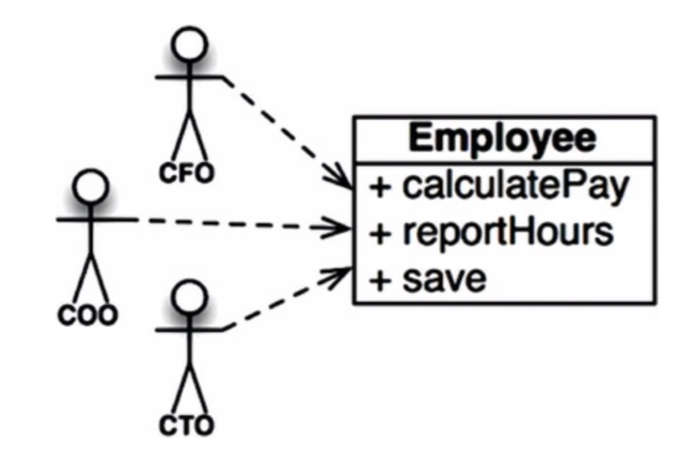
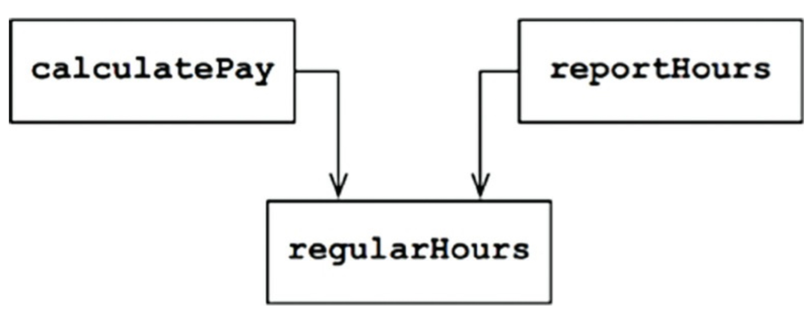

在SOLID所有原则中，单一职责原则(SRP)也许是最不好理解的。这可能是由于它由一个不合适的名字。它很容易让程序员听到这个名字就假设它意味着每个模块应该只做一件事情。

不要误会，有一条类似的原则。一个函数应该做一件且只做一件事情。当我们重构大的函数为小函数的时候会使用这个原则；我们在最底层使用它。但是它不是SOLID原则其中之一--它不是SRP。

历史上，SRP用以下方式描述：
>一个模块应该有且只有一个原因来修改它。

软件系统为了满足用户和利益相关者而被修改。这些用户和利益相关者就是原则所说的”修改的原因“。实际上，我们可以将这个原则重新表述为：
>一个模块应该对一个且只对一个用户或利益相关者负责。

不幸的是，“用户”和“利益相关者”不是用在这里的正确词汇。可能不止一个用户或利益相关者想要以相同的方式修改系统。相反，我们实际上指的是一个组--一个或更多要求修改的人。我们称这样的组为角色。

因此SRP的最终版本为：
>一个模块应该对一个且只对一个角色负责。

现在，我们所说的“模块”意味着什么呢？最简单的定义就是一个源文件。大部分时间里这个定义没有问题。尽管一些语言和开发环境不使用源文件来包含它们的代码。那种情况下模块就是函数和数据结构的内聚集合。

“内聚”这个词暗示了SRP。内聚是绑定代码责任到一个单一角色的力量。

也许最好的理解这条原则的方法是看违反它的时候的征兆。

### 征兆1：意外的重复
我最喜欢的例子是来自薪水账单应用的Employee类。它由三个方法：`calculatePay()`，`reportHours()`，和`save()`。

图7.1

这个类违反了SRP原则因为这三个方法对三个不同的角色负责。

- `calculatePay()`方法由报告给CFO的会计部门指定。
- `reportHours()`方法由报告给COO的人力资源部门指定。
- `save()`方法由报告给CTO的数据库管理员指定。

把这三个方法的源代码放到单一的Employee类，开发者让这些角色和与其它角色耦合了。这种耦合会引起CFO团队的行为会影响到COO团队依赖的某些东西。

例如，假设`calculatePay()`和`reportHours()`函数共享一个计算非超时小时数的通用算法。再假设开发者们小心地不写重复代码，把算法放到一个名叫`regularHours()`的函数。

图7.2

现在假设CFO的团队决定计算非超时小时数的方法需要调整。相反，HR的COO团队不想要这样调整，因为他们为了另一个目的而使用非超时小时数。

开发者按要求做了修改并小心地测试。CFO团队验证了新函数按照预期工作，然后系统被部署了。

当然，COO团队不知道发生了这件事。HR员工继续使用`reportHours()`函数生成的报告--但是现在它们包含不正确的数字。最终问题被发现，COO大怒因为坏的数据花掉了他数百万美元的预算。

我们都见过像这样的事情发生。这些问题发生因为我们把不同角色依赖的代码放的很近。SRP告诉我们要分离不同角色依赖的代码。

