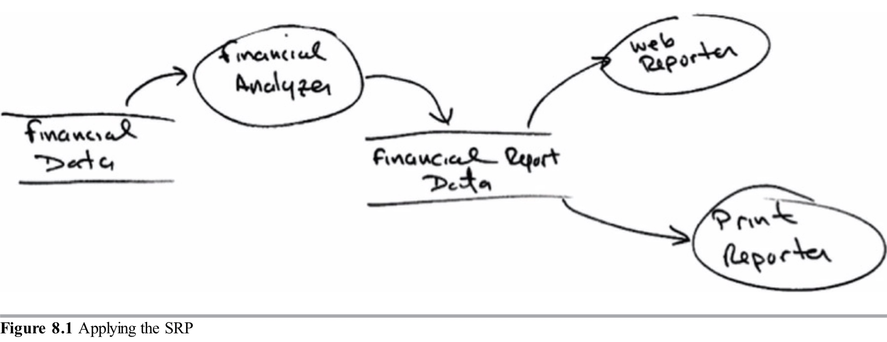
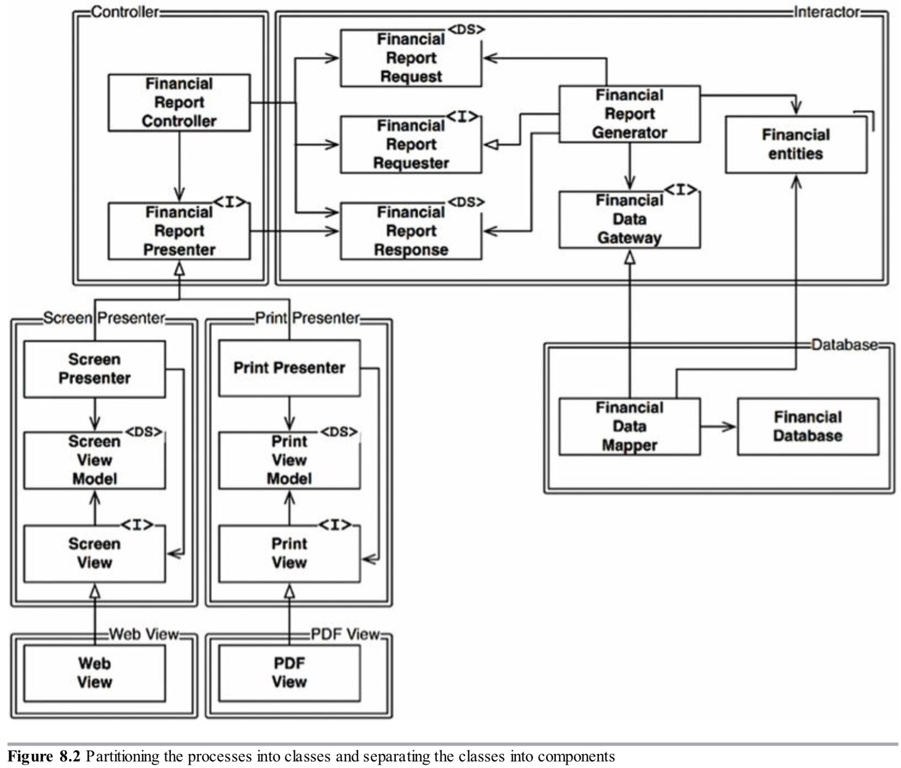
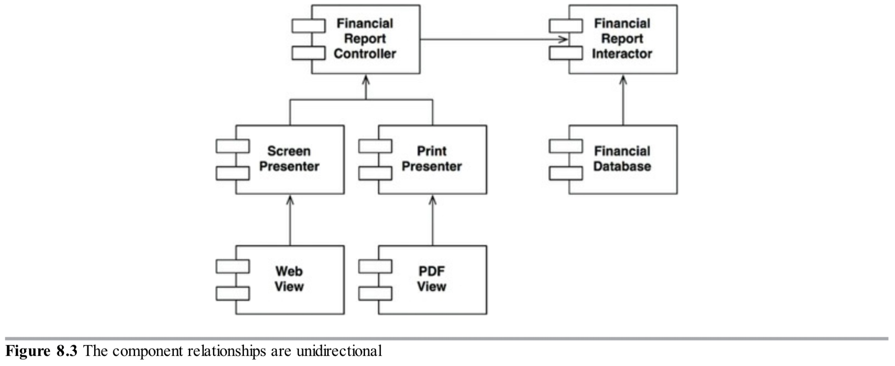

开闭原则(OCP)由Bertrand Meyer于1988年创造。它表述为：

>一个软件包应该对扩展开放而对修改关闭。

换句话说，软件包的行为应该是可扩展的，而不必要修改那个软件包。

当然，这是我们学习软件架构的最基本的原因。很明显，如果对要求的简单扩展迫使对软件进行大规模更改，那么该软件系统的架构师就会陷入一种巨大的失败。

大多数软件设计的学生把OCP当作是指导他们设计类和模块的原则。但是当我们从架构组件的层面来思考时，这条原则会更加重要。

一个思维实验将说明这一点。

### 一个思维实验
想象某一时刻，我们有一个在web页面上展示财务汇总的系统。页面上的数据是可滚动的，负数用红色渲染。

现在想象相关人员要求某些信息转换成报表在黑白打印机上打印。报表应该被合理地分页，有合适的页头，页脚和列标签。负数应该被圆括号包裹。

显然，需要写一些新的代码。但是多少旧代码不得不修改呢？

一个好的软件架构将会减少修改代码的数量到最小。理想情况下为零。

怎么做？通过合理地划分因为不同原因而修改的事物(单一职责原则)，然后在这些事物之间合理地组织依赖(依赖倒置原则)。

通过应用SRP，我们可能会想出如图8.1展示的数据流图。一些分析程序分析财务数据然后产生可报告数据，然后由两个报告程序格式化这些数据。

图8.1

这里的本质是生成报告涉及两个分离的职责：计算报告的数据，和以web以及打印机友好的格式展示数据。

有了这个划分，我们需要组织源代码依赖来确保对其中一个职责的修改不会引起其他部分修改。同样，新的组织应该确保行为可扩展而不用撤销修改。

我们完成这一步通过分割这个过程为类，然后分隔这些类为组件，如图8.2中双线展示的那样。在这张图里，左上方的组件是*Controller*，右上方是*Interactor*。右下方是*Database*。最后，在左下方有四个组件代表*Presenters*和*Views*。

图8.2

用`<I>`标记的类是接口；用`<DS>`标记的是数据结构。打开的箭头是*using*关系。闭合的箭头是*implements*或*inheritance*关系。

第一件要注意的是所有的依赖是源码依赖。一个箭头从类A指向类B意味着类A的源码提到了类B的名字，但是类B没有提到类A。因此，在图8.2，`FinancialDataMapper`通过实现关系知道`FinancialDataGateway`，但是`FinancialDataGateway`不知道`FinancialDataMapper`。

下一件要注意的事是每一个双线只在一个方向上交叉。这意味着所有的组件关系是单向的，如组件图8.3所示。这些箭头指向我们想要保护免受变化的组件。

图8.3

让我再说一次：如果应该保护组件A免受组件B变化的影响，那么组件B应该依赖组件A。

我们想要保护*Controller*免受来自*Presenters*的修改。我们想要保护*Presenters*免受来自*Views*的修改。我们想要保护*Interactor*免受来自任何事物的修改。

*Interactor*处于最符合OCP的位置。对*Database*、*Controller*、*Presenters*或*Views*的修改将不会对*Interactor*产生影响。

为什么*Interactor*应该占有这个有特权的位置？因为它包含业务规则。*Interactor*包含应用的最高层次的策略。所有其他组件处理外围的事情。处理核心的事情。

尽管对于*Interactor*来说*Controller*处于外围，它对于*Presenters*和*Views*来说或多或少位于中心。而*Presenters*对于*Controller*来说处于外围，对于*Views*来说是位于中心的。

请注意这是如何根据“层级”的概念创建保护层次结构的。*Interactor*是最高层次的概念，所以它们受到最多的保护。*Views*是最低层次的概念之一，所以它们受到最少保护。*Presenters*比*Views*层次高，但是比*Controller*或*Interactor*层次低。

这就是OCP在架构层面的工作方式。架构师基于如何、为何以及什么时候修改来划分功能，然后把分离的功能按组件的层次结构来组织。层次结构中高层次组件被保护免受低层次组件修改的影响。

### 方向控制
如果你从前面所示的类设计感到畏缩，再看一次。那张图里大多数复杂性旨在确保组件之间的依赖指向正确的方向。

例如，存在于`FinancialReportGenerator`和`FinancialDataMapper`之间的`FinancialDataGateway`接口是为了反转从*Interactor*组件指向*Database*组件的依赖。`FinancialReportPresenter`和两个`View`接口也是一样。

