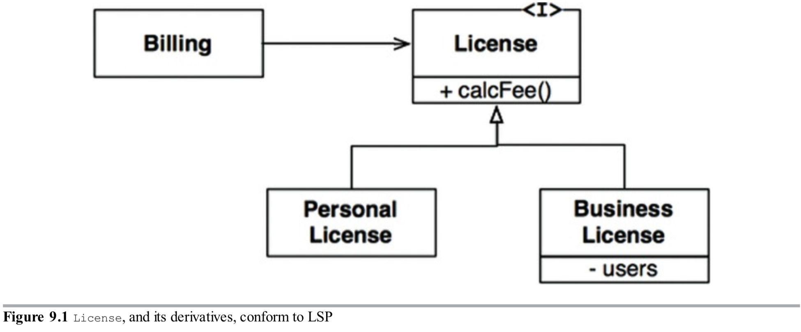
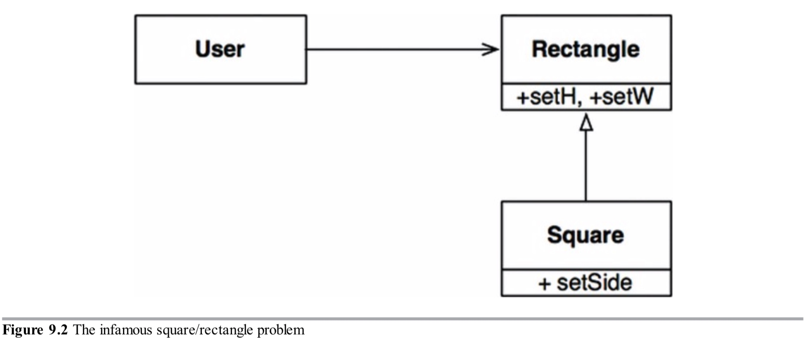

1988年，Barbara Liskov写了如下定义子类型的一种方法：
>这里我们要的是具有如下替换属性的东西：如果对于类型S的每个对象o1，存在一个类型T的对象o2，对于所有用T定义的程序P，当用o1替换o2而P的行为不会改变，那么S是T的子类型。

为了理解这个想法，即里氏替换原则(LSP)，让我们看几个例子。

### 指导继承的使用
想象我们有一个名为`License`的类，如图9.1。这个类有个叫`calcFee()`的方法，它被`Billing`这个应用调用。有两种`License`的子类型：`PersonalLicense`和`BusinessLicense`。它们使用不同的算法计算许可证费。

图9.1


这个设计遵循LSP因为`Billing`这个应用的行为不依赖它使用两种子类型中的哪一种。对于`License`类型两个子类型都是可替换的。

### 正方形/矩形问题
一个违反LSP的权威例子是著名的（或臭名昭著的，取决于你的看法）正方形/矩形问题（图9.2）。

图9.2


在这个例子中，`Square`不是`Rectangle`适合的子类型，因为`Rectangle`的高和宽是独立可变的；相反，`Square`的高和宽必须一起改变。当`User`认为他在与`Rectangle`通信，情况很容易令人困惑。下面的代码展示了原因：

```
Rectangle r = ...
r.setW(5);
r.setH(2);
assert(r.area() == 10);
```
如果`...`生成一个`Square`，那么断言将会失败。

防止此类违反LSP的唯一办法是对`User`（例如一个`if`语句）增加一个机制来检测是否是`Rectangle`，实际上是一个`Square`。因为`User`的行为依赖它使用的类型，那些类型就不是可替换的。

### LSP和架构


